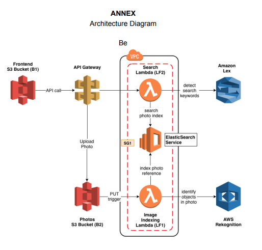

# NLP Controlled Photo Album App

This repo implements the backend of a web photo album application, that can be searched using natural language through text and voice. The archictecture uses AWS Lex, ElasticSearch, and Rekognition to create an intelligent search layer to query uploaded photos.

Included in the repo is a CI/CD pipeline that automatically deploys the lambda functions and updates application stack through
AWS cloudformation.
